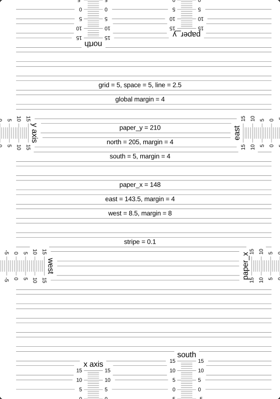

# Paper Guidelines

Create gridlines for printing custom notebook paper. Lines are automatically filled and centered within the available space.

Example with debugging guides enabled:

Dependencies:
* openscad
* [openscad-post-processor](https://github.com/AaronVerDow/openscad-post-processor)
* librsvg
