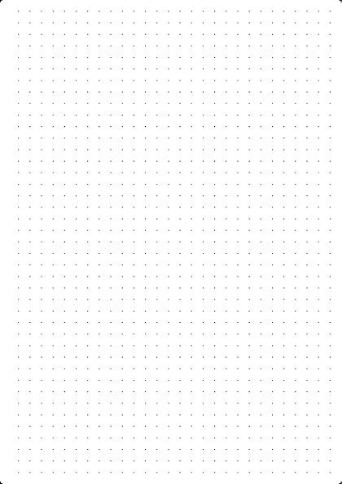
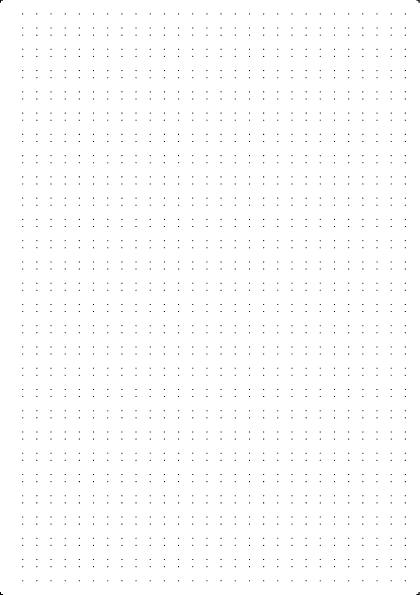
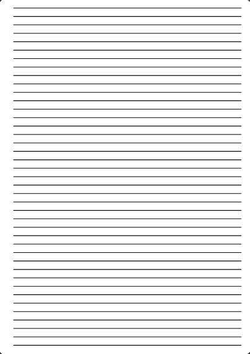
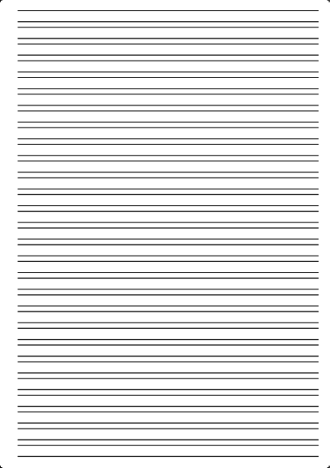
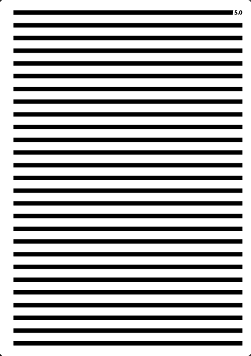

# Paper Guidelines

Create gridlines for printing custom notebook paper. Lines are automatically filled and centered within the available space.

Dependencies:
* openscad
* [openscad-post-processor](https://github.com/AaronVerDow/openscad-post-processor)
* librsvg

# Types

## Dots

## Half Dots

## Lines

## Half Lines

## Bars

Print solid black and place behind blank paper.

# Building

* `bin/bulk_render.py`: WIP python script to render all paper and option combinations
* `bin/render.sh`: quick and dirty render script to make what I actually use using `src/all.scad` and `openscad-post-processor`

# Printing 

Brother HL-L2340DW

* Place paper with holes on left hand side
* Print right/front side
* Place paper back in tray, printed side up, holes on right hand side
* Print left/back side
